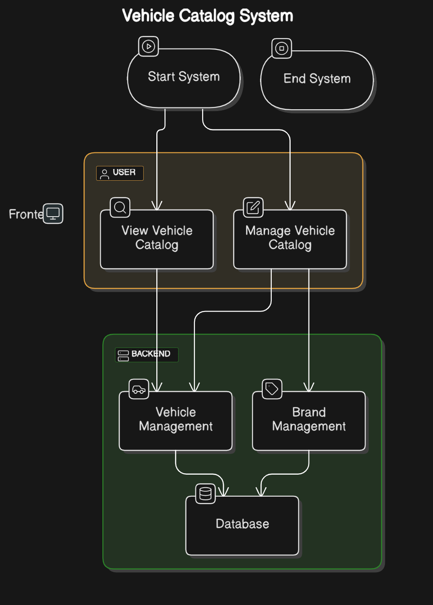
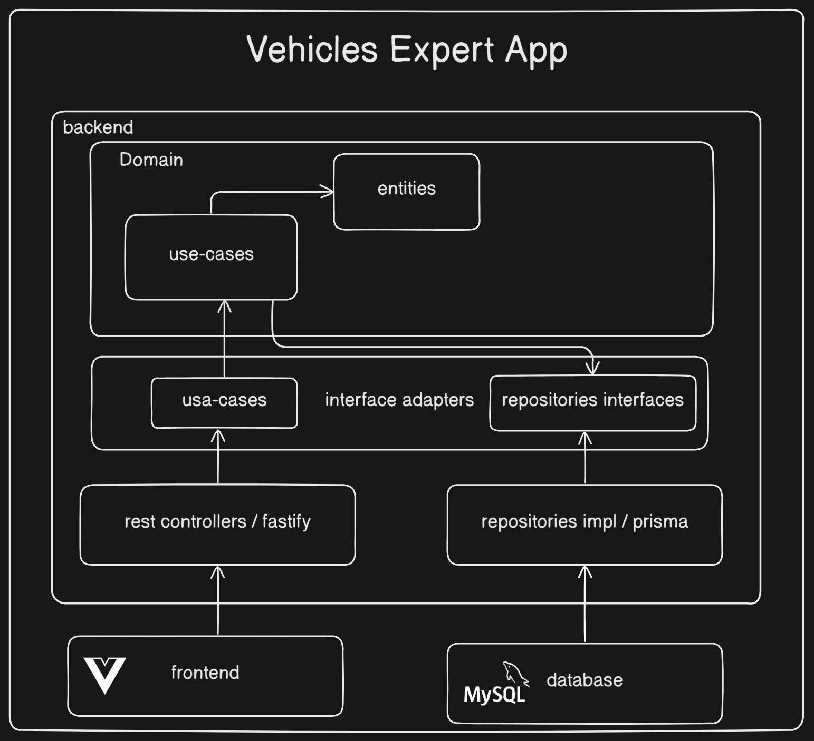
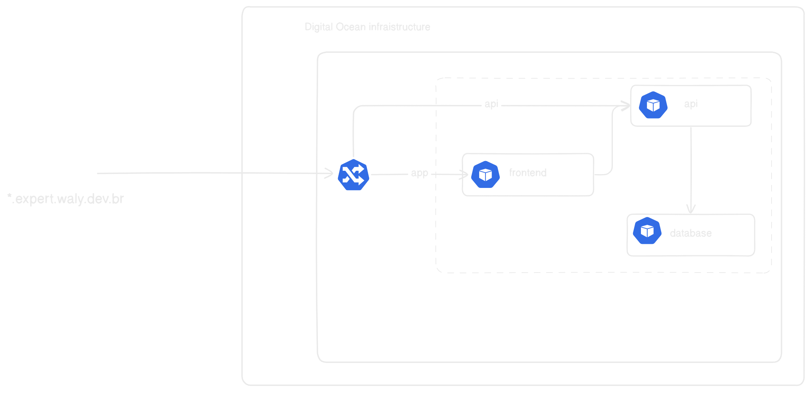

# Vehicle Catalog Application

Este repositório contém a aplicação de catálogo de veículos, que permite o gerenciamento de veículos e marcas. O sistema permite realizar operações como adicionar, editar e remover veículos e marcas, além de consultar informações sobre eles.

## Arquitetura

A arquitetura adotada é baseada no padrão **Clean Architecture**, com o objetivo de garantir alta manutenibilidade, testabilidade e escalabilidade. O backend segue uma estrutura bem definida, separando as responsabilidades de forma clara entre as camadas.

### Camadas da Arquitetura

1. **Camada de Entidades**: Contém as entidades principais do domínio, como `Vehicle` e `Brand`, que representam o núcleo do sistema. Estas entidades são independentes de qualquer framework ou banco de dados.

2. **Camada de Casos de Uso (Use Cases)**: Contém a lógica de negócios do sistema, onde as regras de processamento de dados e decisões de negócios são definidas. Cada caso de uso é responsável por uma funcionalidade específica, como "Adicionar Veículo", "Editar Marca", etc.

3. **Camada de Interface de Entrada (API)**: Exposta através de uma API REST, que comunica com a camada de casos de uso para processar as solicitações do cliente. Aqui, usamos o **Fastify** como framework para construir a API devido à sua alta performance.

4. **Camada de Repositórios (Infraestrutura)**: Responsável por fornecer uma abstração entre o código de negócios e a persistência de dados. Utiliza o **Prisma ORM** para interagir com o banco de dados MySQL.

5. **Camada de Interface de Saída (Externa)**: Aqui estão integrados serviços externos, como por exemplo, o gerenciamento de imagens ou comunicação com outros sistemas. A camada externa também pode incluir configurações de deploy e outros aspectos de infraestrutura.

### Diagrama C4

A arquitetura é visualizada no diagrama C4, que mostra como os sistemas e componentes se interagem.

- **Diagrama de Contexto**: Representa a aplicação de catálogo de veículos e sua interação com os usuários e sistemas externos.

- 

- **Diagrama de Containers**: Exibe a aplicação dividida em containers, mostrando como a API, banco de dados, e outros componentes se comunicam.
- **Diagrama de Componentes**: Mostra os principais componentes internos da aplicação, como o servidor Fastify, os casos de uso e os repositórios.
- 
- **Diagrama de Código**: Fornece uma visão detalhada do código para entender a estrutura interna do sistema.

### Diagrama de Deploy

O diagrama de deploy mostra como a aplicação é configurada e implantada no ambiente de produção, incluindo detalhes sobre o uso de **Docker** e **Kubernetes** para gerenciamento e escalabilidade.



## Deploy

A aplicação é provisionada e implantada usando **Docker** e **Kubernetes**.

1. **Docker**: Cada componente (backend e frontend) é containerizado usando Docker. Arquivos `Dockerfile` estão localizados nas pastas `frontend/` e `backend/` para construir as imagens Docker.

2. **Kubernetes**: A aplicação é orquestrada com Kubernetes. Os arquivos de configuração estão localizados em `helm-files/`, que contêm os manifests do Helm para configurar o backend, frontend, e os serviços necessários no cluster Kubernetes.

3. **Banco de Dados**: O banco de dados utilizado é o MySQL, e a configuração do Prisma está presente na pasta `prisma/`.

### Como rodar a aplicação localmente

Para rodar a aplicação localmente, siga os seguintes passos:

1. Clone o repositório:

```bash
git clone git@github.com:244Walyson/expert.git vehicle-catalog
cd vehicle-catalog
```
### suba usando docker compose
```bash
docker compose up --build -d
```

obs: O comando acima irá subir o banco de dados e a aplicação, para acessar a api acesse http://localhost:3000 
### será nescessarion rodar o frontend manualmente fora do docker, pois falta configuração url da api no frontend para isso

```bash
cd frontend npm i npm run dev
```
a aplicação estará disponível em http://localhost:5173
